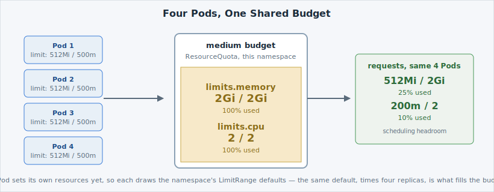

`hello-dcs` is running as one replica right now — one Pod, no redundancy, and if it dies
you're briefly down while it's replaced. Scaling a [**Deployment**](https://kubernetes.io/docs/concepts/workloads/controllers/deployment/)
is how you fix that: you're asking  to keep several identical
copies running instead of one. But "several" isn't free — every copy draws against the
same namespace budget, and that budget is finite.

## Scale it up

Look at the app before you touch it:

```terminal:execute
command: oc get deployment,pods -l app=hello-dcs
```

You should see the Deployment at `1/1` READY and exactly one Pod. Now scale it to four
replicas — the `--replicas` flag sets the desired copy count the Deployment should
maintain:

```terminal:execute
command: oc scale deploy/hello-dcs --replicas=4
```

```examiner:execute-test
name: verify-scaled
title: Verify hello-dcs is scaled to 4 ready replicas
args:
- "4"
timeout: 15
retries: .INF
delay: 2
```

Look again once it settles:

```terminal:execute
command: oc get deployment,pods -l app=hello-dcs
```

```examiner:execute-test
name: verify-scaled
title: Verify hello-dcs is scaled to 4 ready replicas
args:
- "4"
timeout: 10
```

Four Pods now, `4/4` READY —  created three more copies from
the exact same template, each independently scheduled and health-tracked.

## What that costs

None of these four Pods sets its own resource needs, so each one draws your namespace's
[**LimitRange**](https://kubernetes.io/docs/concepts/policy/limit-range/) defaults for a
`medium` budget: a **request** of 128Mi memory / 50m CPU (what it's guaranteed, used for
scheduling) and a **limit** of 512Mi memory / 500m CPU (the ceiling it's capped at). Four
Pods times the default limit is exactly the whole `medium` budget:



Read your namespace's [**ResourceQuota**](/quotas/limits-and-requests)
to see it for real:

```terminal:execute
command: oc describe quota
```

```examiner:execute-test
name: verify-quota-present
title: Verify a ResourceQuota is present in your namespace
timeout: 10
```

You'll see a table of **Used** against **Hard** for each tracked resource. `limits.memory`
and `limits.cpu` should now both read **Used = Hard** — four Pods at the default limit have
used the entire ceiling for those two resources. `requests.memory` and `requests.cpu` are
nowhere near full — the default *request* is much smaller than the default *limit*, so
there's plenty of scheduling headroom even though the limit side is maxed out.


This is exactly the [**ResourceQuota**](https://kubernetes.io/docs/concepts/policy/resource-quotas/)
you read back in B05 — Tenancy & RBAC, if you did that lab — except this time your own
scaling decision is what filled it.


You haven't broken anything yet — `Used` equals `Hard`, not more than it. But there is now
**zero headroom on limits** for anything new. The next page asks for more than that, on
purpose, so you can see what happens.
