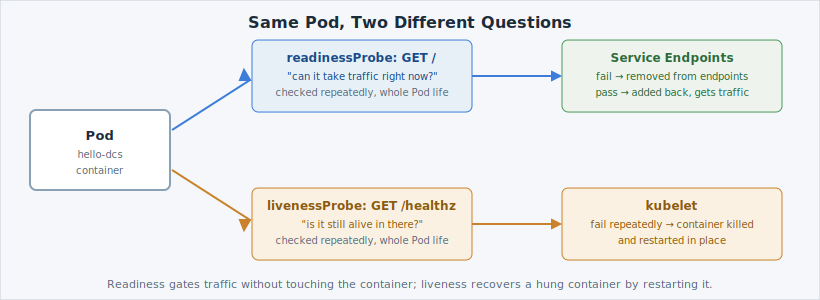

A right-sized Pod that never tells the platform whether it's actually working is still a
gamble —  would happily send traffic to a hung container, or
leave a slow-starting one out of rotation forever. Probes are how a Pod answers two
different questions the platform keeps asking it.

## Two different questions



- **Readiness** — *"can you take traffic right now?"* Fail it, and 
  pulls the Pod out of the Service's endpoints — no traffic reaches it — without touching
  the container at all. Pass it again, and traffic resumes. Nothing restarts.
- **Liveness** — *"are you still alive in there?"* Fail it repeatedly, and the **kubelet**
  kills the container and starts a fresh one in its place, in the same Pod. This is for a
  container that's still running but permanently stuck — readiness alone can't fix that,
  because there's nothing to route traffic *to* once it stops answering at all.

## Confirm the probes are already there

`deployment-probes.yaml` — the file you applied on the last page — already carries both:
a `readinessProbe` on `/` and a `livenessProbe` on the app's dedicated `/healthz`
endpoint. Read them back off the running Deployment:

```terminal:execute
command: oc describe deployment hello-dcs
```

Look for the `Readiness:` and `Liveness:` lines near the bottom of the output — each
names its HTTP path, port, and timing (`initialDelaySeconds`, `periodSeconds`,
`failureThreshold`).

```examiner:execute-test
name: verify-probes-configured
title: Verify hello-dcs has both a readinessProbe and a livenessProbe configured
timeout: 10
```

## Ready, and in the Service

A Pod that passes its readiness probe is added to its Service's list of endpoints — the
addresses traffic actually gets sent to:

```terminal:execute
command: oc get endpoints hello-dcs
```

```examiner:execute-test
name: verify-endpoints-ready
title: Verify hello-dcs has Ready Pods in the Service endpoints
timeout: 10
retries: .INF
delay: 2
```

You should see four IP:8080 pairs — one per ready Pod. That list is what readiness
controls.

## Break readiness on purpose (lower terminal watches)

In the **lower** pane, keep an eye on the Pods while you do this:

```terminal:execute
command: watch oc get pods -o wide -l app=hello-dcs
session: 2
```

`-o wide` adds a few extra columns to the usual table — NODE and IP among them — so you
can see exactly which Pod is affected.

Back in the **upper** pane, point the readiness probe at a path that doesn't exist —
`oc set probe` edits a running Deployment's probe configuration directly, no manifest
edit required:

```terminal:execute
command: |-
  oc set probe deployment/hello-dcs --readiness --get-url=http://:8080/this-path-does-not-exist
```

That's a template change, so  rolls out one replacement Pod at
a time (the default rollout only replaces 25% of replicas at once). The new Pod comes up,
fails its readiness check every 5 seconds, and never gets marked Ready — so it never joins
the Service's endpoints. Watch the lower pane: one Pod's READY column will sit at `0/1`
while the other three stay `1/1`.

```examiner:execute-test
name: verify-readiness-broken
title: Verify one Pod is held out of rotation by the broken readiness probe
timeout: 10
retries: .INF
delay: 3
```

Check the endpoints again:

```terminal:execute
command: oc get endpoints hello-dcs
```

One address short of before — the broken Pod is quarantined, but the other three keep
serving traffic without interruption. **That's the whole point of readiness:** an unhealthy
replica is pulled from rotation, not paraded in front of users, and the rest of the app
never notices.

## Restore it

Re-apply the known-good manifest — the same declarative-recovery move from page 03:

```terminal:execute
command: envsubst < deployment-probes.yaml | oc apply -f -
```

```examiner:execute-test
name: verify-readiness-restored
title: Verify the readiness probe is restored and all replicas are ready again
timeout: 20
retries: .INF
delay: 2
```

```terminal:execute
command: oc get endpoints hello-dcs
```

All four addresses are back. The liveness probe on `/healthz` never came into play here —
`hello-dcs`'s container was always running and answering, just not on the path you pointed
readiness at. Liveness would only kick in if the container itself hung and stopped
answering *any* request, and it recovers by restarting the container rather than routing
around it.
