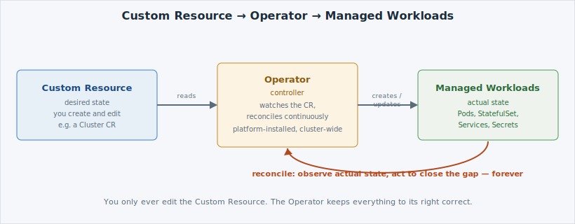

Everything you've deployed so far — a Deployment, a ConfigMap, a Secret — is a single
built-in resource. A real application is usually more than one: a database needs storage
provisioned, a primary elected, replicas configured, backups scheduled, and all of that
kept correct as Pods restart or fail. Encoding that operational knowledge once, in
software, is what an [**Operator**](https://kubernetes.io/docs/concepts/extend-kubernetes/operator/)
does.

## Controller plus reconciliation

An Operator is a **controller** — a process that runs continuously, watching one kind of
object, and driving reality toward whatever that object declares. The loop it runs is
called **reconciliation**: read the desired state, compare it to the actual state, act to
close the gap, and repeat — forever, not just once at creation time. This is the same
control-loop idea a Deployment's controller already uses to keep your replica count
correct; an Operator is that idea extended to a whole application's operational
knowledge, not just "how many Pods."

Briefly: an Operator is an experienced administrator's runbook for one specific piece of
software, automated — the "when X happens, do Y" knowledge a human specialist would apply
by hand, now watching the cluster instead of a person watching a pager.

## What it watches, what it manages

An Operator watches instances of a **Custom Resource** — you'll meet exactly what that
means on the next page — and, based on what it finds, creates and maintains the ordinary
building blocks underneath: Pods, a StatefulSet, Services, Secrets for credentials. You
never touch those directly; you only edit the Custom Resource, and the Operator keeps the
underlying pieces correct on your behalf.


The reconciliation loop never stops. If someone (or something) deletes a Pod the Operator
manages, or changes a setting out of band, the next reconciliation pass puts it back —
the same self-healing idea as a Deployment, just applied to a whole application instead
of one workload.


That loop is what you'll watch happen for real when you create your own Custom Resource
on page 03. First, two more pieces of vocabulary — CRD vs CR, and how an Operator gets
onto the cluster in the first place.

- [Operator pattern](https://kubernetes.io/docs/concepts/extend-kubernetes/operator/)
- [OpenShift Operators overview](https://docs.openshift.com/container-platform/latest/operators/understanding/olm-what-operators-are.html)
