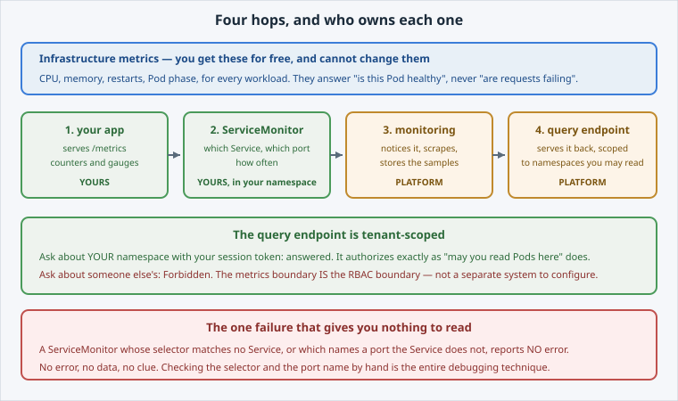

<!-- Edit this file: one slide per line of three dashes. Give a slide a deep-link id with an id-comment on its own line. Markdown: headings, - lists, **bold**, `code`, fenced code, , [text](url). -->

<!-- id: intro -->
# Metrics & Monitoring

The platform measures your Pods for free. It cannot measure what your app is *doing* unless the app says so.

**In this lab:** the pipeline and who owns it · exposing metrics · asking to be scraped · querying with PromQL · the tenancy boundary.

Digital Container Service · DCS Academy

---

<!-- id: pipeline -->
## What the platform already knows

Two kinds of metric, and confusing them wastes time.

- **Infrastructure** — CPU, memory, restarts, for every Pod. Free, generic, unchangeable.
- **Application** — requests, failures, queue depth. Only your app can produce them.
- Four hops: your app exposes → your ServiceMonitor asks → the platform scrapes → a tenant-scoped endpoint serves it back.
- You own both ends. You never configure Prometheus.



---

<!-- id: expose -->
## What the app says

Plain text, three kinds of line, and that is the whole contract.

```
# HELP hello_dcs_requests_total Requests served, by path.
# TYPE hello_dcs_requests_total counter
hello_dcs_requests_total{path="/"} 12
```

- **HELP** — what it means. **TYPE** — counter, gauge, and a couple more.
- **Labels** in braces make one metric into many series you can filter and sum.
- A **counter** only goes up, so its raw value is uninteresting — its `rate()` is the point.
- Each replica counts its own requests; that is why you scrape all endpoints, not one.

---

<!-- id: servicemonitor -->
## Ask to be scraped

One object, in your own namespace. The platform finds it.

```
oc apply -f servicemonitor.yaml
oc get servicemonitor hello-dcs -o jsonpath='{.spec.selector.matchLabels}'
oc get svc -l app=hello-dcs
```

- `selector` matches the **Service's** labels, not the Pods'.
- `endpoints.port` is the port **by name** — a number does not work, and an unnamed port cannot be scraped.
- **A selector that matches nothing reports no error.** No error, no data, no clue.
- Checking the selector and the port name by hand is the debugging technique.

---

<!-- id: query -->
## Query your own metrics

Your session token, the tenant endpoint, your namespace.

```
curl -sk -H "Authorization: Bearer $TOKEN" \
  --get "$THANOS_URL/api/v1/query" \
  --data-urlencode "namespace=$(oc project -q)" \
  --data-urlencode 'query=sum by (pod) (rate(hello_dcs_requests_total[5m]))'
```

- Read it inside out: samples over 5m → per-second rate → collapsed per Pod.
- The platform adds labels of its own: `namespace`, `pod`, `service`.
- Ask about **another** namespace and you get **Forbidden** — authorized exactly like "may you read Pods there".
- Tenancy is enforced in the metrics path, not only in the API.

---

<!-- id: console -->
## The same data, with a graph

Everything you queried by hand is in the console, drawn instead of printed.

- **Observe → Metrics** — a PromQL box and a time range.
- **Observe → Targets** — proof that a scrape is actually happening.
- **Developer → Observe** — per-workload graphs, including your custom metrics.
- Three panels worth having: is it serving, is it failing, is it struggling.
- An **alert** is just a query with a threshold and a duration, written as a `PrometheusRule` in your namespace.

---

<!-- id: next -->
## What's next

Your app now says what it is doing, the platform collects it, and the boundary around it is the same one RBAC draws.

**Next — Logs:** metrics tell you *that* something changed; logs tell you *what happened*. Same tenancy boundary, very different data.

Digital Container Service · DCS Academy
