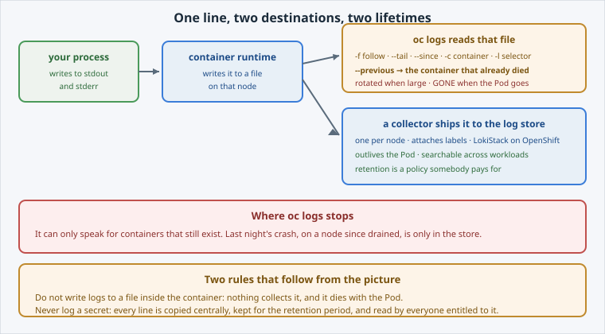

<!-- Edit this file: one slide per line of three dashes. Give a slide a deep-link id with an id-comment on its own line. Markdown: headings, - lists, **bold**, `code`, fenced code, , [text](url). -->

<!-- id: intro -->
# Logs

Metrics tell you *that* something changed. Logs tell you *what happened*.

**In this lab:** where logs live · reading them with intent · the logs of a crash · where `oc logs` stops · the aggregated store.

Digital Container Service · DCS Academy

---

<!-- id: where -->
## Where logs actually live

A container has no log file to configure. It writes to stdout, and the platform takes it from there.

- The runtime writes it to a **file on the node**; `oc logs` reads that file.
- A **collector** reads the same file and ships it to the central store.
- Nothing parses your lines on the way — whatever structure they have is the structure you gave them.
- Do **not** write logs to a file inside the container: nothing collects it and it dies with the Pod.



---

<!-- id: reading -->
## Reading with intent

`oc logs <pod>` prints everything since startup. On a busy app that is useless — the flags are the skill.

```
oc logs deploy/hello-dcs --tail=20
oc logs -l app=hello-dcs --tail=5 --prefix
oc logs -l app=hello-dcs --since=5m
oc logs -f deploy/hello-dcs
```

- `deploy/…` reads **one** Pod. `-l` reads them all, and `--prefix` is what tells them apart.
- `--since=5m` is the incident flag: what was it saying five minutes ago.
- `-f` follows live, and ends when the Pod does.

---

<!-- id: crash -->
## The logs of a crash

The container that can explain the failure has already been replaced by one that knows nothing.

```
oc get pods -l app=flaky          # RESTARTS climbing
oc logs <pod> --previous --tail=20
```

- **`--previous`** reads the **last terminated** container in that Pod.
- That is where the fatal line is: *cannot reach the database at db.internal:5432*.
- Reaching for it first is a two-minute diagnosis instead of twenty minutes of guessing.
- Between restarts there may be no running container to read at all.

---

<!-- id: aggregation -->
## When the Pod is gone

Delete the workload and `oc logs` has nothing to read. Incidents outlive Pods, and nodes.

```
{namespace="my-team-dev", app="hello-dcs"} |= "FATAL"
sum by (pod) (rate({namespace="my-team-dev"} |= "FATAL" [5m]))
```

- A **collector** per node ships every line to a **LokiStack**, with labels.
- **LogQL**: select by labels first, then filter lines — `|=`, `!=`, `|~`.
- The same `rate()` and `sum by` as metrics, over log lines.
- Authorized per namespace, exactly like metrics.
- **Never log a secret.** Central store, full retention, everyone entitled to the namespace.

---

<!-- id: next -->
## What's next

You can read logs deliberately, recover a crashed container's last words, and you know exactly where that ability ends.

Metrics and logs both stop at your namespace boundary. **RBAC & Tenancy** is where that boundary is drawn, and **DEV vs PROD Namespaces** is what the platform enforces on top of it.

Digital Container Service · DCS Academy
