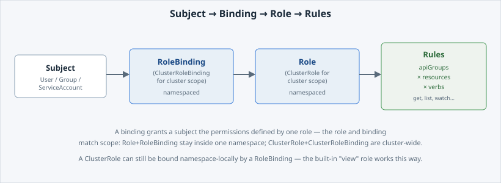

<!-- Edit this file: one slide per line of three dashes. Give a slide a deep-link id with an id-comment on its own line. Markdown: headings, - lists, **bold**, `code`, fenced code, , [text](url). -->

<!-- id: intro -->
# RBAC & Tenancy

"Why can't I see the other team's Pods?" has an exact answer, and it is readable. This lab opens the mechanism behind Tenant and Namespace.

**In this lab:** the two-level model · can-i · the objects behind the answer · build the chain yourself · quotas.

Digital Container Service · DCS Academy

---

<!-- id: tenancy -->
## Tenant to Namespaces

Two levels, not three. A **Tenant** is the org-level unit used for recharging and accountability; it owns one or more **Namespaces**.

- "Project" is OpenShift's word for a namespace — **not** a third layer.
- **RBAC** decides who may act on what, inside which namespace.
- **Network Policies** decide which workloads may talk to each other (observe-only for tenants today).
- Your access is scoped to your tenant's namespaces, because nothing grants you a rule elsewhere.

```
oc project
oc get namespace $(oc project -q) -o jsonpath='{.metadata.labels}'
```

---

<!-- id: can-i -->
## Start from "can I?"

Before reading a single Role, ask the cluster directly. It answers from the objects it has already computed.

```
oc auth can-i --list
oc auth can-i create deployments
oc auth can-i get pods -n kube-system
```

- `--list` prints every permission you hold in this namespace.
- A direct question gets `yes` or `no`.
- Pointed at someone else's namespace, the answer is **no** — that is tenancy, enforced.

---

<!-- id: objects -->
## The objects behind the answer

Four object types, two scopes — and the answer is just the chain read end to end.

- **Role** — permissions inside one namespace. **ClusterRole** — cluster-wide, or reusable per namespace.
- **RoleBinding** — grants a role to a subject in one namespace. **ClusterRoleBinding** — cluster-wide.
- **rule** — apiGroups × resources × verbs.
- **subject** — a User, a Group, or a **ServiceAccount**.
- On DCS, tenants own Roles and RoleBindings in their namespaces; cluster-scoped RBAC is platform-managed and read-only.



---

<!-- id: least-privilege -->
## Prove least privilege

Build the chain for a subject you create, and test it without ever logging in as it.

```
oc apply -f serviceaccount-viewer.yaml
oc auth can-i get pods --as=system:serviceaccount:$SESSION_NAMESPACE:viewer-bot   # no
oc apply -f role-viewer.yaml
envsubst < rolebinding-viewer.yaml | oc apply -f -
oc auth can-i get pods --as=system:serviceaccount:$SESSION_NAMESPACE:viewer-bot   # yes
```

- A Role on its own grants nothing — it is a shelf of permissions with nobody assigned.
- The **before/after** pair is the proof, and `--as` is how you get it.
- Read-only verbs only: `delete pods` still answers **no**.

---

<!-- id: quotas -->
## Quotas

Your namespace came with limits you did not set, and they are readable.

```
oc describe quota
oc get limitrange -o yaml
```

- **ResourceQuota** — the ceiling for the whole namespace.
- **LimitRange** — the per-container defaults applied when a manifest sets none.
- More quota is an **ITSM request**, not a field you edit — it costs real capacity somebody pays for.

---

<!-- id: next -->
## What's next

You can now read any access decision on this platform, and prove one you made yourself.

**Next lab — DEV vs PROD Namespaces:** the policy posture that separates the two namespace types, what PROD enforces that DEV does not, and how work is promoted between them.

Digital Container Service · DCS Academy
