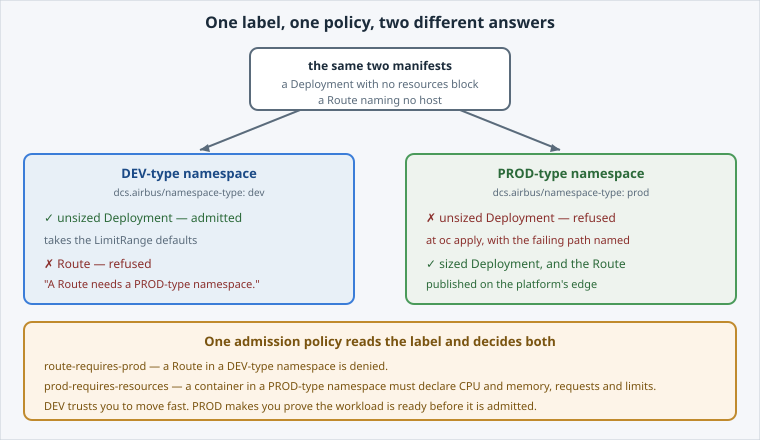

Both of your lab namespaces run the same Kubernetes, on the same cluster, with the same
image registry.

What separates them is a **label** — and the policy that reads it.

Open the slide for this page (📊 **Slides** tab):

```dashboard:reload-dashboard
name: Slides
url: :///slides/#/types
```



## Look at the two you were given

```terminal:execute
command: oc get namespace $DEV_NS $PROD_NS --show-labels
```

Read the `dcs.airbus/namespace-type` label: one says `dev`, the other `prod`. That label is
the entire technical difference between them.

```examiner:execute-test
name: verify-both-namespaces
title: Verify both lab namespaces exist, one of each type
timeout: 30
retries: .INF
delay: 3
```

## The policy that reads it

The platform runs an **admission policy** that matches on that label. It is a cluster-scoped
object — and you cannot read it:

```terminal:execute
command: oc auth can-i list clusterpolicies
```

```examiner:execute-test
name: verify-policy-not-readable
title: Verify the platform's policy is not yours to read
timeout: 30
retries: .INF
delay: 3
```

**`no`** — and that is the correct answer. Platform policy is owned by the platform: you
cannot read it, edit it, or bypass it. What you *can* do is experience it, precisely and
repeatably, which is what the rest of this lab does.

Two rules are in play here, and between them they are this lab:

- **`route-requires-prod`** — a Route in a DEV-type namespace is refused.
- **`prod-requires-resources`** — a container in a PROD-type namespace must declare CPU and
  memory requests **and** limits.


**📌 This is a representative slice, not the whole DCS posture.** Real PROD namespaces carry
more rules than these two. They are the two that can be demonstrated end to end inside a
training session, and they are genuine: the refusals you are about to get come from the
cluster's real admission path, and each one names the rule that produced it.


## Why the split exists

- **DEV** trusts you to move fast. Deploy something half-finished, iterate, break it.
- **PROD** makes you prove the workload is ready before it is admitted — sized, and therefore
  schedulable and accountable against a budget somebody pays for.

The trade is deliberate: the same cluster gives you a place to be sloppy and a place where
sloppiness is refused at the door.

Next: use the DEV namespace exactly as intended.
