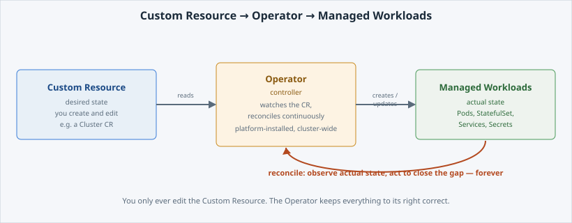

<!-- Edit this file: one slide per line of three dashes. Give a slide a deep-link id with an id-comment on its own line. Markdown: headings, - lists, **bold**, `code`, fenced code, , [text](url). -->

<!-- id: intro -->
# Operators on DCS

Every platform service you are offered arrives the same way: as an operator. This lab opens one up and uses it.

**In this lab:** the pattern · CRDs and CRs · create an instance · who owns what.

Digital Container Service · DCS Academy

---

<!-- id: pattern -->
## The pattern

An operator is a **controller** watching for objects of a kind it understands, making reality match them. The same reconcile loop a Deployment runs, applied to something bigger than a Pod.

- You write **desired state**; the operator does the work and keeps doing it.
- It encodes the operational knowledge a human would otherwise apply by hand.
- Failover, backups and upgrades become fields rather than runbooks.
- It is not magic: it is a Pod, watching the API, reconciling.



---

<!-- id: crds -->
## CRDs and CRs

A **CustomResourceDefinition** teaches the cluster a new **kind**. A **Custom Resource** is one object of that kind — your instance.

```
oc get crds | grep postgresql
oc api-resources --api-group=postgresql.cnpg.io
oc explain cluster.spec --api-version=postgresql.cnpg.io/v1
```

- The CRD is installed by the **platform**, with the operator.
- `oc explain` works on custom kinds too — the CRD carries the schema.
- OLM and OperatorHub are how operators get installed and upgraded.

---

<!-- id: instance -->
## Create an instance

A PostgreSQL cluster, in a few lines. Count what you did **not** have to write.

```
oc apply -f sample-cr.yaml
oc get cluster sample-db
oc get all
```

- No image, no StatefulSet, no PVC, no Service, no probes — the operator creates them.
- `status.phase` is the operator reporting back: *Cluster in healthy state*.
- No `imageName` on purpose: the platform configures which operand image the operator may run.

---

<!-- id: ownership -->
## Who owns what

The split that matters on DCS, and the one people get wrong during an incident.

- **The platform owns the operator** — installing it, upgrading it, the CRDs, the operand images it may use.
- **You own the instance** — its configuration, its data, its backups, its day-2.
- "The database is down" is usually your instance, not the operator.
- It is not a managed service: nobody is watching your database for you.

---

<!-- id: next -->
## What's next

You have met the pattern behind GitLab, Argo CD and PostgreSQL on this platform.

The **Operators track** takes each of those in turn: provisioning a real instance, owning it properly, and the day-2 work that comes with it.

Digital Container Service · DCS Academy
